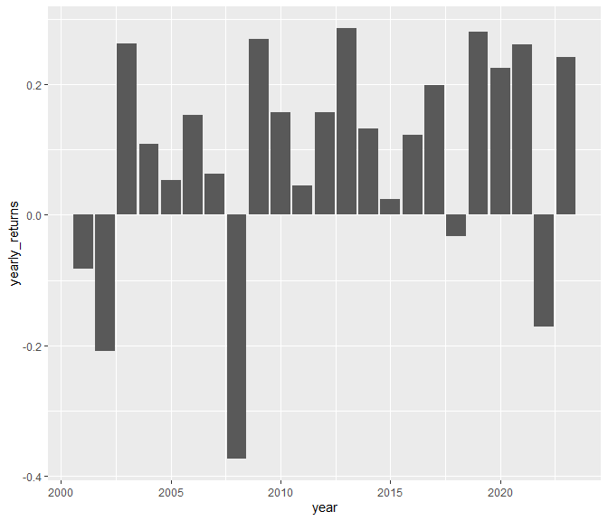

wk2-workshop
================
Nicholas Lee
2024-01-24

- [1. Find the following statistics about the S&P
  returns.](#1-find-the-following-statistics-about-the-sp-returns)
- [2. Create a plot that shows the prices of S&P in this
  period.](#2-create-a-plot-that-shows-the-prices-of-sp-in-this-period)
- [3. Create a plot that shows the total yearly returns of S&P from 2001
  to
  2023.](#3-create-a-plot-that-shows-the-total-yearly-returns-of-sp-from-2001-to-2023)

### We have 5798 days of data, starting from Jan 3 2001 to Jan 22 2024.

## 1. Find the following statistics about the S&P returns.

``` r
df = readRDS("../../../OneDrive - National University of Singapore/Y3S2/DSE3101/data/wk2_stocks.rds")
```

The cumulative returns of the S&P index during this period is 218.33%.

The average daily returns of the S&P index during this period is 0.04%.

The standard deviation of the daily returns of the S&P index during this
period is 1.22%.

## 2. Create a plot that shows the prices of S&P in this period.

``` r
library(ggplot2)
ggplot(data = df, aes(x = date, y = SPY_prices)) +
  geom_line()
```

<!-- -->

## 3. Create a plot that shows the total yearly returns of S&P from 2001 to 2023.

``` r
library(dplyr)
library(lubridate)
df %>%
  mutate(year = year(date)) %>%
  filter(year >= 2001, year <= 2023) %>%
  group_by(year) %>%
  summarise(yearly_returns = sum(SPY_returns)) %>%
  ggplot(aes(x = year, y = yearly_returns)) +
  geom_col()
```

<!-- -->
